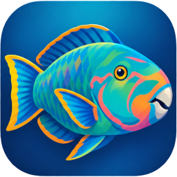

# Parrotfish



Parrotfish is an unofficial TeamSpeak 3 client written in Rust with a [Slint](https://slint.dev) GUI.
It signs in with a regular TeamSpeak identity, shows the channel tree, sends and receives text
chat, and carries voice in both directions with Opus. It also plays Speex, which old servers
still use; CELT, the other old format, is not played.

Until version 0.4.1 the program was called PhishSpeak. Parrotfish takes over its settings folder
the first time it starts, so identities, bookmarks, saved passwords and keys carry over, and
its installer replaces an installed PhishSpeak. Close PhishSpeak first, and do not go back to
old copies afterwards: they would start empty, in a folder of their own.

- A compact window: the channel tree, a chat drawer, and a dock with mute buttons and the
  microphone level. Spacer channels such as `[cspacer]Games` are drawn as dividers.
- Channels fold and open from an arrow. A setting chooses how they start (all open, empty ones
  folded, all folded), and the channels you fold or open yourself are remembered for each server.
- Bookmarks for one-click connections, each with the channel to join if you want one. A
  bookmark can connect when Parrotfish starts and can keep the server's and the channel's
  password, stored encrypted for your Windows account.
- The icons a server sets up: on channels, on people (their groups and their own) and for the
  server itself. PNG, JPEG, and GIF as a still picture.
- Several servers at once. You hear all of them; your microphone goes to the one you are
  viewing, and on the others people see it switched off, as with the server tabs of the
  TeamSpeak client.
- Click a person for private messages, a poke, their details, and a volume and mute that apply
  to that person only and are remembered. Right-click a channel for its topic and description.
- A switch that evens out how loud people are: someone who comes in loud is turned down at
  once, someone quiet is brought up, and you can leave single people out of it. While a
  priority speaker talks, everyone else is lowered by as much as the server says, as in the
  TeamSpeak client. You can also make a person, or everyone in a channel, a priority speaker
  for yourself alone: right-click them.
- A small "who is speaking" window you can put anywhere: it lists who is talking and, for a few
  seconds, who just did. Lock it and it lets clicks through and hides while nobody speaks. It can
  stay above other windows and be made see-through. It is an ordinary window, so it shows over
  games that run in a window or borderless window, not over exclusive full screen.
- Talk keys you choose by pressing them: any key, mouse button 3 to 5, or a combination, and
  more than one if you like. They work while Parrotfish is in the background. Keys for muting
  the microphone and the sound work the same way.
- Whisper keys that send your voice to the channels and people you tick, or to everyone, the
  channel commanders or a server or channel group in the channels above, below or around yours,
  plus a key that replies to whoever whispered to you last.
- For the microphone: echo cancelling for when you listen through speakers, steady-noise
  suppression, and automatic gain. All three are off by default and none has been judged by ear
  yet.
- Short sounds for events such as someone joining or a message arriving, with their own volume.
- A connection that drops is picked up again by itself, back in the channel you were in.
- Privilege keys, asking to talk in moderated channels, and the usual address lookups (SRV
  records and TSDNS), so a plain server name works as it does in the TeamSpeak client.
- `ts3server://` links, if you switch that on under Settings, Bookmarks. A link opens the
  connect window filled in and tells you what it carries; it never connects by itself.
  Switching it off gives the links back to the program that had them.
- It updates itself: when it starts it asks GitHub whether a newer release exists, tells you,
  and replaces itself when you say so. Settings, About switches the asking off.
- One settings window with tabs: microphone, sound, identities, bookmarks, shortcuts, channels,
  about.

It is early software. It has been tested against a TeamSpeak 3.13.8 server, but not yet in a
conversation with the official client, and voice has not been tried on a public server.
[PLAN.md](PLAN.md) lists what works, what has been verified and what is still missing.

## Build and run

You need Rust (stable, MSVC toolchain) on Windows 10 or 11.

```
build.bat
target\release\ps-app.exe
```

`build.bat` runs `cargo build --release -p ps-app`. During development, `cargo run -p ps-app`
builds faster. To connect straight away, name a bookmark or give an address:

```
target\release\ps-app.exe --connect host[:port] --nickname YourName --channel "Channel name"
```

`--connect` can be repeated to open several servers; `--nickname` and `--channel` are optional
and apply to the `--connect` before them. A `ts3server://` link can be given the same way; a
link is always taken alone, and whatever else stands beside it is ignored, so that a link
cannot carry orders of its own. If Parrotfish is already running, a second start passes these
on to it and leaves.

On first start Parrotfish creates an identity for you. To use one from the TeamSpeak client,
export it there and add the file under Settings, Identities; Parrotfish reads the file where it
is and never changes it. Settings, bookmarks, whisper keys and identities created in the app are
stored in `%APPDATA%\Parrotfish`. A password typed while connecting is never saved; one typed
into a bookmark is kept encrypted for your Windows account.

## Updates

When it starts, Parrotfish asks GitHub which release is the newest; it sends nothing but its
name and version. If there is a newer one, a line in the window says so. Nothing is installed
until you press Update: Parrotfish then downloads the release, checks it against the checksum
published with it, and hands over to `update.exe`, which swaps the files once Parrotfish has
closed and starts it again. That ends your connections: after the restart the same line says
whether the update went through, and Parrotfish connects again only to bookmarks that are set
to connect at start. `Parrotfish.exe --update` looks once and installs what it finds
without asking, also when Parrotfish is already running. Settings, About has the switch for
the asking and a button to look right away. The checksum catches a download that is broken or
mixed up; it is not a signature, and the files are not signed.

Version 0.5.0 and the PhishSpeak versions before it do not look for updates. Install a newer
release over them once by hand; from then on Parrotfish offers its updates itself.

Parrotfish only replaces itself in a folder of its own. `update.exe` makes the folder match
the new release, which means it removes every file the release does not have, so a copy that
shares its folder with anything else (a copy on the desktop, say) only offers the download
page. Give a portable copy a folder of its own, or use the installer, and do not keep files of
your own in the program's folder. An installed copy also puts its version into Windows' list
of installed apps after it has updated itself.

`update.exe` is not specific to Parrotfish. The `updater` folder is the same, byte for byte, as
the one in [Eve-Strait](https://github.com/littlephish/eve-strait/tree/main/updater); Ore Hold
Watcher carries an earlier version of the same helper. Fix a bug in one and carry it to the
others.

## Releases

Pushing a tag builds a release; nothing else does. Set the version in `Cargo.toml`
(`[workspace.package]`), commit, then:

```
git tag v0.6.0
git push origin v0.6.0
```

The `Release` workflow checks that the tag is `v` plus that version, runs the tests, builds the
program with the C runtime linked in, tries the installer on the build machine
(`tools/installer_test.py`: over an installed PhishSpeak, on its own, and the installed
program updating itself from a stand-in release), and publishes an
installer (`Parrotfish-<version>-setup.exe`, per user, no administrator prompt), a zip of the
program with `update.exe`, and `SHA256SUMS.txt` on the repository's Releases page. Both carry
`THIRD-PARTY-NOTICES.txt`, the licence texts of every library in the program, collected at build
time. Ordinary pushes and pull requests only run the tests (the `Check` workflow); a push that
changes the installer also runs the `Installer` workflow, which builds it and tries it the same
way without publishing anything.

Installed copies read a release with the code they already have, so these can never change:

- the repository's owner and name;
- tags of the form `v<a>.<b>.<c>` and no others: a tag such as `v0.7.0-rc1` would become the
  newest release, and no installed copy could read it;
- the zip's name, `Parrotfish-<version>-windows-x64.zip`, and what it is: `Parrotfish.exe` and
  `update.exe` with no folders, at most 64 files with plain names (letters, digits, dot, dash,
  underscore and space, 80 characters at most), at most 300 MB packed and 600 MB unpacked;
- `SHA256SUMS.txt`, with one line for the zip: its SHA-256, two spaces, its name.

A file that is new in the zip also needs a line under `[UninstallDelete]` in
`installer/parrotfish.iss` and a place in `OWN_FILES` in `ps-app/src/update.rs`; without them a
copy that updated itself leaves the file behind when it is removed, and stops updating itself.

To make the same files on your own PC, install [Inno Setup 6](https://jrsoftware.org/isinfo.php)
and run `python tools/package_release.py`; they land in `dist/`. Add `--skip-installer` for the
zip alone. The files are not code-signed, so Windows will ask before running the installer.

## Tests

```
cargo test --workspace
```

The unit tests need no server. The tools under `ps-client/examples`, `ps-voice/examples` and
`tools/` exercise a real server, the talk and whisper keys and the local sound devices; PLAN.md
explains how to use them.

## Layout

| Crate | What it does |
|---|---|
| `ps-identity` | TeamSpeak identities: import, export, security level, signing |
| `ps-crypto` | Packet encryption, licence chain and the key exchange |
| `ps-protocol` | Packet framing, commands, compression, fragmentation |
| `ps-client` | The connection: handshake, reliability, channels, clients, voice packets |
| `ps-oldcodecs` | The Speex decoder, for voice from old channels |
| `ps-voice` | Opus, resampling, jitter buffer, mixing, microphone and speaker devices |
| `ps-app` | The window |
| `updater` | `update.exe`, which swaps the files of a new release in; a project of its own, not part of the workspace |

## Credits

Parrotfish exists because other people worked out and published how the TeamSpeak 3 protocol
behaves. The code in this repository was written for this project; the public projects below
supplied the protocol knowledge, and in one case test data.

**Protocol sources**

- [ReSpeak/tsdeclarations](https://github.com/ReSpeak/tsdeclarations) (MIT or Apache-2.0).
  `ts3protocol.md` is the written description of the wire protocol that Parrotfish follows: packet
  layout, encryption, the Init1 puzzle, the licence chain and the key exchange. The client version
  and signature Parrotfish presents to servers come from its `Versions.csv`, and error codes and
  message fields were checked against `Errors.csv` and `Messages.toml`.
- [ReSpeak/tsclientlib](https://github.com/ReSpeak/tsclientlib) (MIT or Apache-2.0), in particular
  `tsproto`, `tsproto-packets` and `tsproto-types`. This Rust implementation was the reference for
  how acknowledgements, receive windows, packet counters and the first handshake packets behave in
  practice. **Test vectors in `ps-crypto`, `ps-identity` and `ps-protocol` are taken from its test
  suite**: the licence blobs and derived key, the shared-IV and key/nonce values, the dummy-key
  packet, a captured `clientinit` packet, a server licence signature, and the identity UID and
  security-level cases.
- [Splamy/TS3AudioBot](https://github.com/Splamy/TS3AudioBot) (OSL-3.0), its `TSLib` library
  (`TsFullClient.cs`, `PacketHandler.cs`, `TsCrypt.cs`, `License.cs`). Read as a behavioural
  reference for the order of the handshake, which packets use the temporary key, the Init1 packet
  layouts and the connection-statistics reply. No TSLib code was copied.
- [Manevolent/ts3j](https://github.com/Manevolent/ts3j) (Apache-2.0). A Java client used to
  cross-check the handshake and the `clientinit` parameters.
- [landave/TSIdentityTool](https://github.com/landave/TSIdentityTool) (MIT). The identity
  obfuscation used in TeamSpeak's identity exports was published there; tsclientlib credits it,
  tsdeclarations documents the algorithm, and `ps-identity` implements it.

**Echo cancelling**

- The echo canceller is Parrotfish's own code. It is a multidelay block frequency-domain
  adaptive filter (J.-S. Soo and K. K. Pang, 1990) with the learning-rate control described by
  Jean-Marc Valin in "On Adjusting the Learning Rate in Frequency Domain Echo Cancellation With
  Double-Talk" (2007), which is how the echo canceller in
  [Speex](https://www.speex.org) (Xiph.Org Foundation, BSD-3-Clause) works. The Speex source was
  the reference for the structure of that part and for its constants.

**Speex**

- `ps-oldcodecs` contains a Rust rewrite of the decoder of [Speex](https://www.speex.org) 1.2.1
  (Xiph.Org Foundation, Jean-Marc Valin and others, BSD-3-Clause). It follows the reference
  code step by step and gives the same samples; the codebooks are the reference's own. The
  licence text is in `ps-oldcodecs/LICENSE-speex.txt` and in the notices shipped with releases.

**Libraries**

- [Slint](https://slint.dev) for the interface, used under the Slint royalty-free licence;
  the About tab in settings carries its mark.

  [](https://slint.dev)
- [Opus](https://opus-codec.org) by the Xiph.Org Foundation, through
  [unsafe-libopus](https://github.com/DCNick3/unsafe-libopus), a Rust translation of libopus 1.3.1
  (BSD-3-Clause).
- [cpal](https://github.com/RustAudio/cpal) for sound devices and
  [rtrb](https://github.com/mgeier/rtrb) for the capture ring buffer.
- [quicklz](https://crates.io/crates/quicklz), the ReSpeak implementation of the compression
  TeamSpeak uses for large commands.
- The [RustCrypto](https://github.com/RustCrypto) crates (`aes`, `eax`, `sha1`, `sha2`, `p256`),
  [curve25519-dalek](https://github.com/dalek-cryptography/curve25519-dalek), `num-bigint`,
  `base64` and `rand`.

## TeamSpeak

TeamSpeak is a trademark of TeamSpeak Systems GmbH. Parrotfish is an independent project and is
not affiliated with, endorsed by or supported by TeamSpeak. It introduces itself to servers with a
client version string and signature published in tsdeclarations; server owners may not permit
third-party clients, so check the rules of the servers you join.
